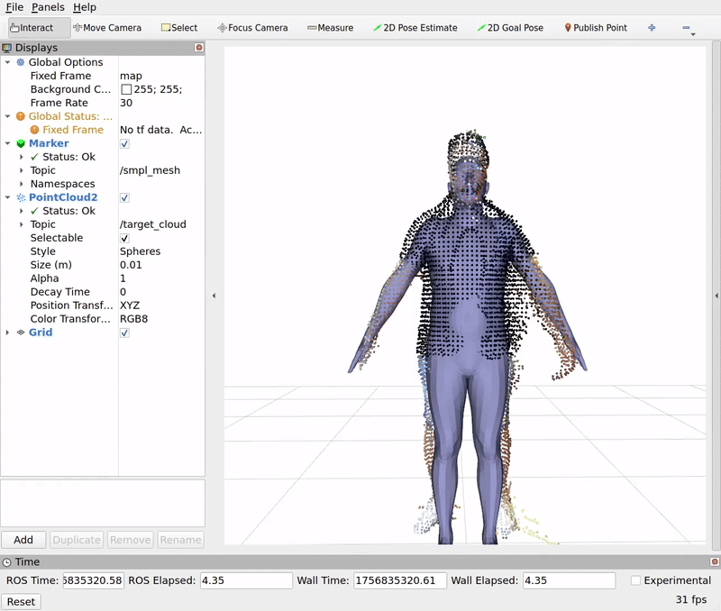

# 🌟 smpl_ros  
*A ROS 2 package for integrating SMPL with real-time Rviz visualization*  

---

## 🔍 Overview  
`smpl_ros` brings the **SMPL human body model** into the ROS 2 ecosystem with seamless **Rviz visualization support**.  
It’s designed to make working with 3D human meshes in robotics and visualization pipelines **simple, fast, and flexible**.  

---
<div align="center">
    
</div>

## 📦 Dependencies  
To get started, make sure you have the following installed:  

- **ROS 2** (tested with **Humble**)  
- **[Open3D C++ library](https://github.com/isl-org/Open3D/releases)**  
  - Used for point cloud loading and downsampling  
  - *Alternatively, you can use PCL with minor code changes*  
- **CUDA** *(optional)* – Enables GPU acceleration  
- **[torchure_smplx](https://github.com/Hydran00/torchure_smplx)** – C++ SMPL Torch implementation

---

## ⚙️ Installation  
1. Convert your SMPL model in `.npz` format. You can download the `.pkl` from the [SMPL website](https://smpl.is.tue.mpg.de/) (registration required) and convert it using the provided [script](https://github.com/Hydran00/torchure_smplx/blob/main/scripts/pkl2npz.py)
2. Export required paths to `Open3D` and `torchure_smplx` CMake files
    ```
    export Open3D_DIR=~/path_to_your_open3d_build/lib/cmake/Open3D
    export torchure_smplx_DIR=~/path_to_your_torchure_smplx_build
    ```
3. (Optional) Configure CUDA  
    ```
    CUDA_VERSION=<your_cuda_version>
    export PATH="/usr/local/cuda-${CUDA_VERSION}/bin:$PATH"
    export LD_LIBRARY_PATH="/usr/local/cuda-${CUDA_VERSION}/lib64:$LD_LIBRARY_PATH"
    ```
4. Clone the repository   
    ```
    cd ~/your_ros2_ws/src
    git clone https://github.com/idra-lab/smpl_ros.git
    git clone https://github.com/idra-lab/smpl_msgs.git
    ```
5. Build the workspace  
    ```
    cd ~/your_ros2_ws
    colcon build --symlink-install
    source install/setup.bash
    ```

## 🚀 Running the Node
A fitting procedure example is provided in `fitting_smpl_ros.cpp`, it can be run with:
```
ros2 launch smpl_ros smpl_ros_fitting.launch.py \
    model_path:=/path/to/SMPL_model.npz \
    config_path:=/path/to/config.json \
    point_cloud_path:=/path/to/point_cloud.ply
```
which will also open an Rviz window to visualize the process.
